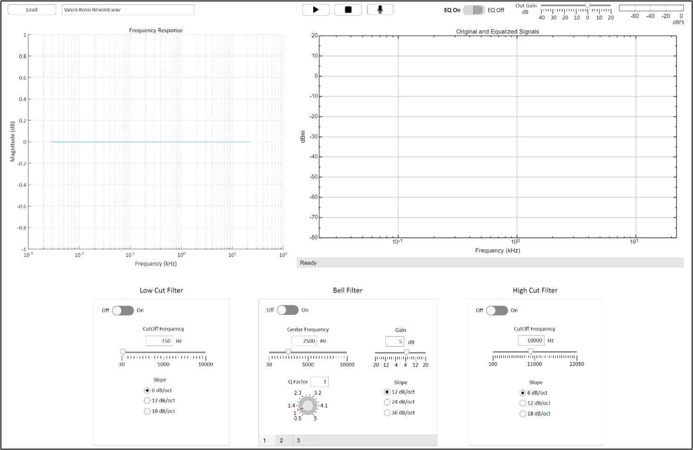

# Parametric Equalizer

## Overview
This application implements a digital parametric equalizer with five customizable frequency bands. Two of these bands are dedicated to a high-pass filter and a low-pass filter, while the remaining three are bell filters.

As a parametric equalizer, the user can adjust parameters such as:
- Filter frequency
- Gain
- Quality factor (Q)
- Slope

## Features
- Equalize an existing audio track
- Equalize a new audio track recorded using the default input device

## User Interface
Once the track is loaded or recorded, the user is taken to the main interface, where the audio signal can be processed. The main screen is the following:

